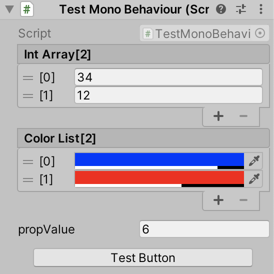

## Easy Editor

Enhancements to Unity Editor/inspector.

Some Attributes are added to complement the Unity native Editor, making it easier and faster to use.

1. Button

It is used to mark a method. When a method is marked, there will be a button in the inspector and click it you can call the method.

2. ReorderableList

Mark an array or List and make it drawn in the inspector as a `ReorderableList`.

3. ShowInInspector

Mark a property then it will be drawn in the inspector, and the corresponding `set` will be called when its value is changed in the inspector.

The following is an example of a comprehensive demonstration.

```C#
public class TestMonoBehaviour : MonoBehaviour
{
    [Button]
    void TestButton()
    {
        Debug.Log("TestButton");
    }

    [ReorderableList]
    public int[] intArray;

    [ReorderableList]
    public List<Color> colorList;

    private int backValue = 1;

    [ShowInInspector]
    public int propValue
    {
        set
        {
            if (value != backValue)
            {
                backValue = value;
                Debug.Log($"value changed to {value}");
            }
        }
        get { return backValue; }
    }
}

```

And the inspector will be like:



## Usage

Clone this repository and copy it to your project folder, or add `https://github.com/aillieo/EasyEditor.git#upm` as a dependency in the Package Manager window.